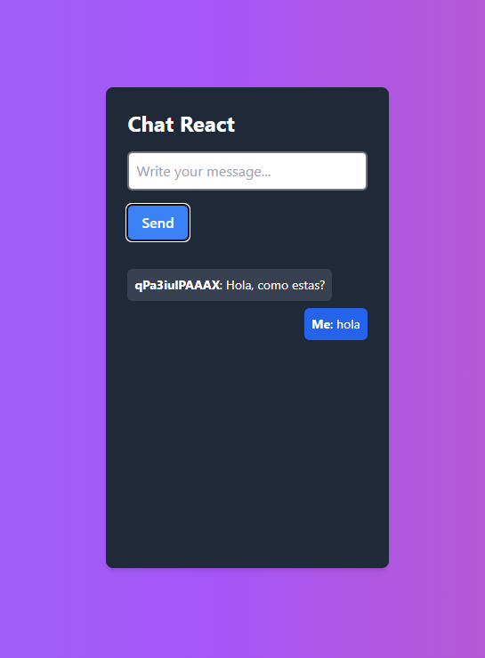

# Chat en tiempo real con React, Node y Socket.io

Este proyecto es un chat en tiempo real construido con React, Node.js y Socket.io. Permite a los usuarios enviar mensajes y ver las respuestas en tiempo real.

## Características

- Envío y recepción de mensajes en tiempo real.
- Interfaz de usuario simple y fácil de usar.
- Integración con Socket.io para la comunicación en tiempo real.

## Capturas de pantalla

